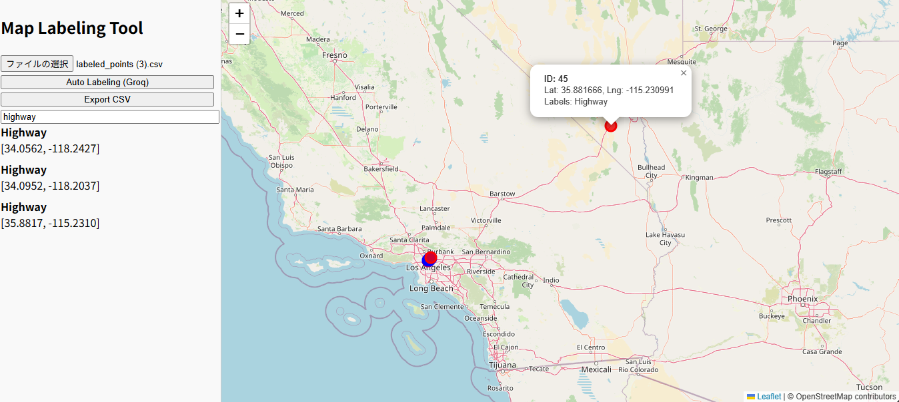

# 🗺️ Map Labeling Tool with groq api

このツールは、CSVで与えられた緯度経度情報に対してOpenStreetMapとLLM（Groq + LLaMA3）を活用し、自動的に地理的特徴（例：都市部・交差点・橋・高速道路など）をラベル付けし、インタラクティブなマップ上に可視化するWebアプリケーションです。



---

## ✨ 主な機能

- 📍 **CSVで地点データを読み込み**
- 🤖 **Groq APIで地理的ラベルを自動付与**
- 🗂 **サイドバーでラベル一覧表示＋検索フィルタ**
- 🌈 **ラベル種別に応じたマーカーの色分け**
- 🧭 **マーカーをダブルクリックでGoogleストリートビュー表示**
- 📤 **ラベル付きデータをCSVでエクスポート**

---

## 🧪 使用例

CSVファイルを読み込むと、地図上に自動的にマーカーが配置されます。


「Auto Labeling」ボタンを押すと、Groq APIを経由してLLMが地点の特徴に応じたラベル（例："Urban area", "Highway" など）を生成し、マーカーとサイドバーに反映します。


マーカーは色分けされており、例えば「Highway」は赤、「Bridge」は緑です。また、マーカーをダブルクリックすると該当地点のGoogleストリートビューが別タブで開きます。

---

## 📁 使用方法

### 1. 依存ライブラリのインストール（Pythonサーバー）

```bash
pip install flask flask-cors openai requests
```

### 2. Groq APIキーの設定
このアプリケーションはgroqを利用しています。公式サイトにログインし、APIキーを生成してください。生成された鍵をgroq_api_key.txtに入力してください。

### 3. Flaskサーバーの起動
groqの推論処理及び、データの加工のバックグラウンド処理をpythonで実装しています。```requirement.txt```をpipでインストールの上、以下コマンドを実行ください。

``` bash
python auto_annotator.py
```

### 4.main.htmlの起動
任意のブラウザで```main.html```を開いてください。

## 想定する入力フォーマットについて
地点情報の入力は以下のような想定しています。
``` csv
id,latitude,longitude
1,35.681236,139.767125
2,34.385202,132.455293
```


## 💡 補足機能
検索欄からラベル名の部分一致でマーカー一覧を絞り込み

処理対象が100件を超える場合は自動的に分割して順次ラベル付け

ラベリング中は「⏳ ラベリング中...」と表示してUIフィードバック

## 🛡️ 注意点
本アプリは開発用途向けです。商用利用や大量アクセスはGroq APIの制限にご注意ください。

groq_api_key.txtは.gitignoreに含め、絶対に公開しないでください。
